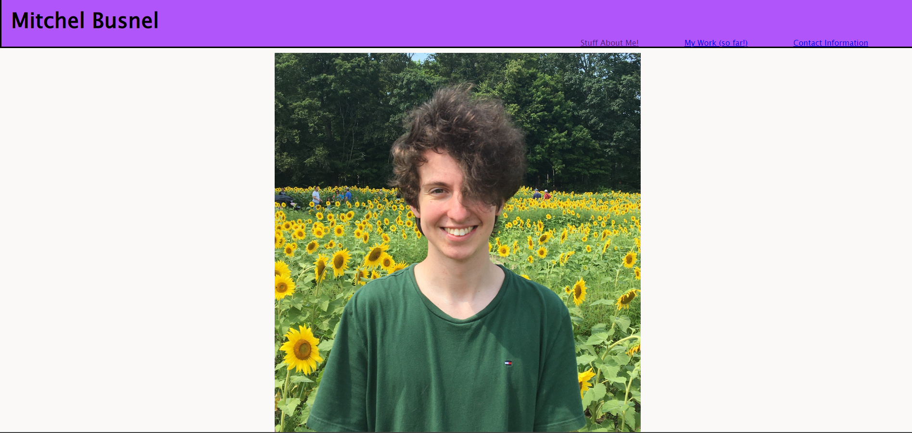
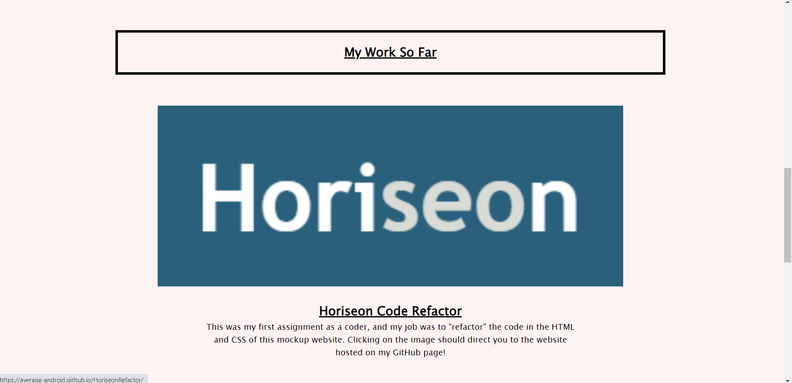

# PortfolioAlpha
<h1>Preview:</h1>

<h1>It's finally done!!</h1>

My website is finally finished after a week of work! It's not much, but it's a huge accomplishment for me! It contains the work I have so far, and info about me as well! And it was made from scratch by somebody with zero coding experience prior to taking this course! Progress, baby!!

<a href="https://average-android.github.io/PortfolioAlpha/">Here is the link to my website!!</a>

